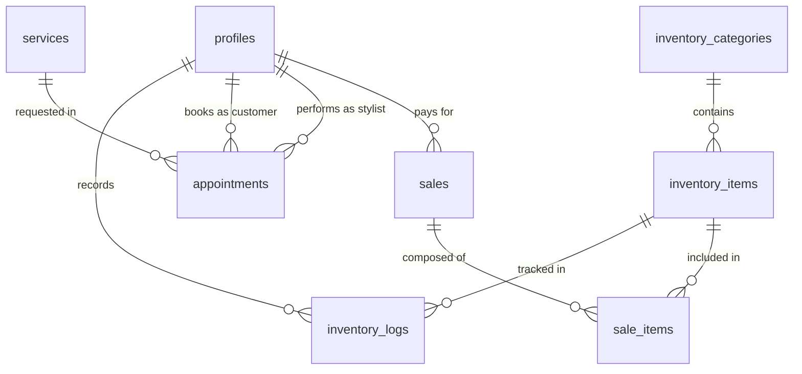

# Supabase Database Documentation

This document provides a comprehensive overview of the Supabase database schema, Row-Level Security (RLS) policies, and backend logic (functions/triggers) used in the GlowUp application.

## 1. Database Schema Overview

The database is built on PostgreSQL and follows a relational structure. Key systems include User Profiles, Inventory, Services & Appointments, and POS.

### Entity Relationship Diagram (ERD)

## 2. Tables Reference

### `profiles`
Stores user information for customers, stylists, and admins.
- **Columns**: `id` (UUID, PK), `full_name`, `email`, `phone`, `role` (admin/stylist/customer), `specialization` (TEXT[]), `bio`, `experience_years`, `rating`, `working_hours` (JSONB), `days_off` (INT[]), `created_at`.
- **Note**: The `id` is typically mapped to the Supabase Auth `id`, but can be "detached" for manually recruited artisans.

### `inventory_categories`
Groups inventory items for better organization.
- **Columns**: `id` (UUID, PK), `name`, `description`, `created_at`.

### `inventory_items`
Tracks products used or sold in the salon.
- **Columns**: `id` (UUID, PK), `category_id`, `name`, `description`, `sku`, `unit`, `min_stock_level`, `current_stock`, `buy_price`, `sell_price`, `image_url`, `created_at`.

### `inventory_logs`
Detailed audit trail of all inventory movements (in/out/adjustments).
- **Columns**: `id` (UUID, PK), `item_id`, `user_id`, `type` (in/out/adjustment), `quantity`, `remaining_quantity` (for FIFO), `reason`, `created_at`.

### `services`
Defines the salon rituals and treatments offered.
- **Columns**: `id` (UUID, PK), `name`, `description`, `duration_minutes`, `price`, `category`, `image_url`, `created_at`.

### `appointments`
Manages the ritual schedule between customers and stylists.
- **Columns**: `id` (UUID, PK), `customer_id`, `stylist_id`, `service_id`, `start_time`, `end_time`, `status` (pending/confirmed/completed/cancelled), `notes`, `total_price`, `created_at`.

### `sales`
High-level transaction records for the POS system.
- **Columns**: `id` (UUID, PK), `customer_id`, `total_amount`, `sscl`, `discount`, `payment_method`, `received_amount`, `balance_amount`, `created_at`.

### `sale_items`
Line items for each sale transaction.
- **Columns**: `id` (UUID, PK), `sale_id`, `item_id`, `quantity`, `unit_price`, `total_price`, `created_at`.

## 3. Row-Level Security (RLS) Policies

RLS is enabled on all tables to ensure data privacy and role-based access control.

| Table | Policy Name | Operation | Access Condition |
| :--- | :--- | :--- | :--- |
| `profiles` | Users can view own profile | SELECT | `auth.uid() = id` |
| `profiles` | Admins can view all profiles | SELECT | Role is `admin` |
| `profiles` | Admins can manage profiles | INSERT/UPDATE/DELETE | Role is `admin` |
| `inventory_categories` | Anyone can view categories | SELECT | `true` |
| `inventory_categories` | Admins can manage categories | ALL | Role is `admin` |
| `inventory_items` | Anyone can view items | SELECT | `true` |
| `inventory_items` | Admins can manage items | ALL | Role is `admin` |
| `inventory_logs` | Staff can view/insert logs | SELECT/INSERT | Role in `admin`, `stylist` |
| `services` | Anyone can view services | SELECT | `true` |
| `services` | Admins can manage services | ALL | Role is `admin` |
| `appointments` | Users can view relevant | SELECT | Owns appt OR is `admin` |
| `appointments` | Users can book | INSERT | `auth.uid() = customer_id` |
| `appointments` | Staff can manage | ALL | Role in `admin`, `stylist` |
| `sales` | Staff can manage sales | ALL | Role in `admin`, `stylist` |

## 4. Functions & Triggers (Backend Logic)

### `update_inventory_stock()`
- **Trigger**: `BEFORE INSERT ON inventory_logs`
- **Logic**: Automatically updates `inventory_items.current_stock` when a new log entry is created. Supports `in` (increase), `out` (decrease), and `adjustment` (relative change).

### `handle_sale_stock_reduction()`
- **Trigger**: `AFTER INSERT ON sale_items`
- **Logic**: Implements FIFO (First-In-First-Out) logic for stock consumption. It finds the oldest `in` logs with remaining quantity, reduces them, and creates a corresponding `out` log for the sale.

### `handle_new_user()`
- **Trigger**: `AFTER INSERT ON auth.users`
- **Logic**: Automatically creates a basic `customer` profile when a new user signs up via Supabase Auth.

## 5. Storage Buckets

### `inventory`
Publicly readable bucket used for product images and artisan avatars.
- **Policies**:
    - `Public Access`: Anyone can view (SELECT) objects.
    - `Authenticated Upload`: Authenticated users can insert objects.
    - `Authenticated Update/Delete`: Authenticated users can modify/remove objects.

## 6. Key Logic Flows

### FIFO Inventory Tracking
When a product is sold:
1.  `sale_items` entry is created.
2.  `handle_sale_stock_reduction` trigger fires.
3.  Trigger finds oldest `inventory_logs` where `type = 'in'` and `remaining_quantity > 0`.
4.  Updates `remaining_quantity` on the "in" log.
5.  Inserts a new "out" log.
6.  `update_inventory_stock` trigger fires (on the new "out" log).
7.  `inventory_items.current_stock` is updated.
